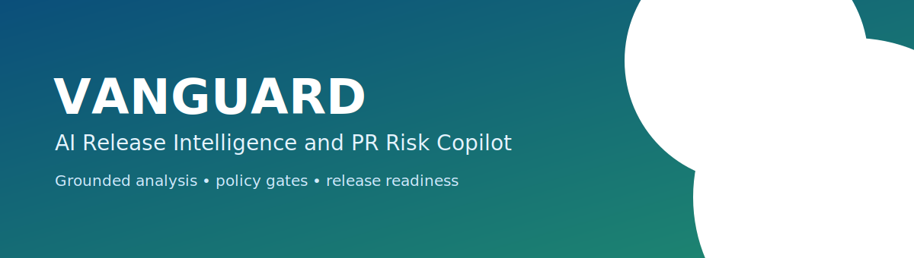
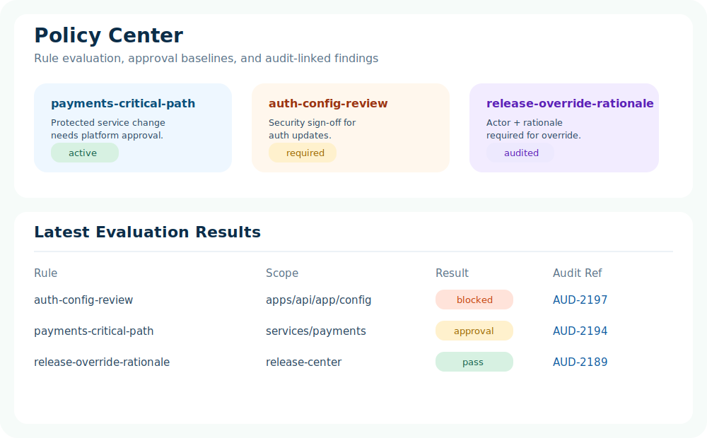

# VANGUARD

**AI Release Intelligence and PR Risk Copilot**

[](apps/api)
[](apps/web)
[](infra/neo4j)
[](infra/postgres)
[](LICENSE)

VANGUARD is a local-first engineering intelligence platform for pull request and release operations. It evaluates risk before merge, maps change blast radius, detects test and CI gaps, enforces policy gates, and generates grounded summaries for PR and release decision-making.

## Why This Matters

Modern delivery pipelines fail less from syntax errors and more from weak change visibility:
- PRs touch critical paths without complete ownership context.
- CI failures hide in flaky or retried jobs.
- Releases proceed with unresolved policy debt.
- Teams rely on intuition when risk evidence should be explicit.

VANGUARD makes delivery intelligence inspectable and operational.

## Feature Grid

| Capability | What VANGUARD does |
|---|---|
| Pull Request Intelligence | Ingests PR metadata, changed files, CI/test signals, ownership, and generates grounded analysis |
| Dependency Impact | Traverses service dependency graph and computes transitive blast radius |
| Risk Scoring | Computes explainable score with weighted factors and confidence warnings |
| Test Intelligence | Surfaces coverage deltas, flaky tests, failure diagnostics, and missing test suggestions |
| CI Intelligence | Aggregates failing jobs, retries, and unstable pipelines into release signals |
| Policy Engine | Evaluates approval and release-blocking rules with rationale |
| Release Center | Produces release readiness score, blocker list, approval state, and notes preview |
| Auditability | Logs analyses, eval runs, approvals, and overrides with actor/rationale |
| Evals | Runs benchmark suite for reviewer relevance, impact quality, policy correctness |
| Observability | Structured logs, request IDs, dependency health checks, stage-aware diagnostics |

## Product Surfaces

- Dashboard
- PR Workspace
- Release Center
- Impact Explorer
- Test Intelligence
- CI Health
- Policy Center
- Approvals Queue
- Audit Log Viewer
- Engineering Insights
- Status and Dependency Health
- Settings and Provider Visibility

## Architecture

VANGUARD is organized as a control tower:
- Operator surfaces live in the Next.js app.
- FastAPI orchestrates risk, policy, graph, release, and audit workflows.
- Intelligence engines turn repository and runtime evidence into decisions.
- Seeded datasets and infrastructure services keep local scenarios reproducible.


## Core Flows

### PR Analysis Lifecycle


### Dependency Impact Traversal


### Test and CI Intelligence Flow


### Release Readiness and Approval Flow


### Policy Evaluation Flow


### Eval Pipeline and CI Gate Flow


## Risk Scoring Model

Risk score is the weighted sum of measurable factors capped at 100:

$$
\text{risk} = \min(100, \sum_i \text{contribution}_i)
$$

Factors currently include:
- changed file count
- protected path touches
- critical service impact
- CI failures and retries
- coverage regression and failed/flaky tests
- transitive dependency depth

Each analysis response includes factor-level rationale and confidence metadata.

## Policy and Approval Baseline

Implemented baseline governance:
- Critical payments path changes require platform approval.
- Auth configuration changes require security approval.
- High-risk release candidates block readiness without justified override.

Override requests require actor and rationale and are audit-logged.

## Auditability and Observability

- Structured JSON logs with request IDs.
- API latency headers (`x-latency-ms`).
- Dependency health endpoint for PostgreSQL, Redis, Neo4j, OpenSearch.
- Audit event stream for analysis, eval runs, approvals, and overrides.

## UI Preview Assets

- Dashboard: 
- PR Workspace: 
- Release Center: 
- Policy Center: 

## API Overview

Core endpoints:
- `GET /health`
- `GET /health/dependencies`
- `GET /api/v1/pull-requests`
- `GET /api/v1/pull-requests/{id}`
- `POST /api/v1/pull-requests/{id}/analyze`
- `GET /api/v1/pull-requests/{id}/impact`
- `GET /api/v1/pull-requests/{id}/reviewers`
- `GET /api/v1/pull-requests/{id}/tests`
- `GET /api/v1/pull-requests/{id}/ci`
- `GET /api/v1/pull-requests/{id}/risk`
- `GET /api/v1/releases`
- `GET /api/v1/releases/{id}`
- `POST /api/v1/releases/{id}/evaluate`
- `GET /api/v1/releases/{id}/readiness`
- `POST /api/v1/releases/{id}/approve`
- `POST /api/v1/releases/{id}/override`
- `GET /api/v1/services`
- `GET /api/v1/services/{id}`
- `GET /api/v1/services/{id}/graph`
- `GET /api/v1/policies`
- `POST /api/v1/policies/evaluate`
- `GET /api/v1/audit`
- `GET /api/v1/evals`
- `POST /api/v1/evals/run`
- `GET /api/v1/providers`
- `GET /api/v1/config/public`

## Local Setup

### 1. Bootstrap

```bash
cp .env.example .env
make up
```

### 2. Run API and Web (without Docker app containers)

```bash
cd apps/api && uv run uvicorn app.main:app --reload --host 0.0.0.0 --port 8080
cd apps/web && npm install && npm run dev
```

### 3. Validate

```bash
curl http://localhost:8080/health
curl http://localhost:8080/api/v1/pull-requests
open http://localhost:3000
```

## Repository Structure

```text
VANGUARD/
  apps/
    api/
    web/
  datasets/
  docs/
  infra/
  packages/
  scripts/
```

## Design Tradeoffs

- Local deterministic provider is used to keep outputs grounded and reproducible.
- Neo4j and OpenSearch are provisioned for realistic infra shape; graph traversal currently uses seeded graph logic for deterministic local runs.
- SQLAlchemy models are included as a migration-ready baseline while seeded JSON provides immediate offline scenarios.

## Example Workflow

1. Open PR Workspace and analyze PR-3413.
2. Inspect high risk factors (CI failures, auth config changes, coverage drop).
3. Review blocked policy findings requiring security approval.
4. Move to Release Center and inspect unresolved blockers.
5. Process pending team approval in Approvals Queue.
6. Run eval benchmark and inspect audit trail.

## Roadmap

- Live ingestion from GitHub webhooks and CI providers.
- Persisted analysis snapshots in PostgreSQL.
- Neo4j-backed query mode with incremental graph updates.
- Better flaky test trend modeling.
- Release note templating with policy/risk provenance tags.
- SLO dashboards and alerting hooks.
