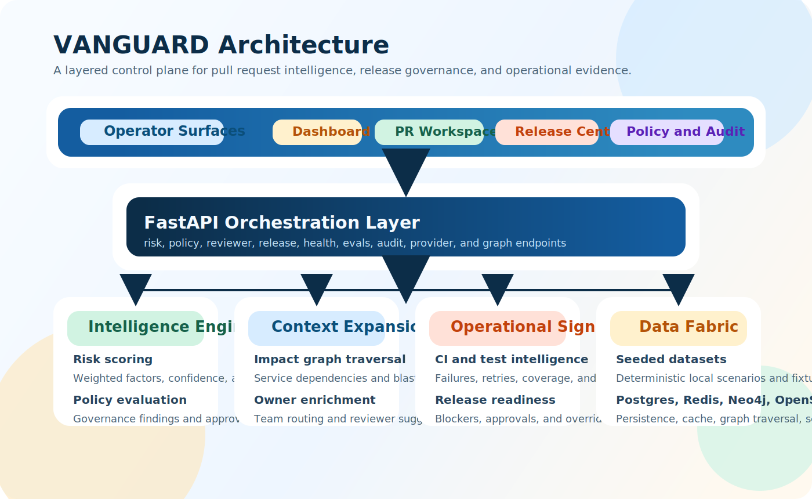
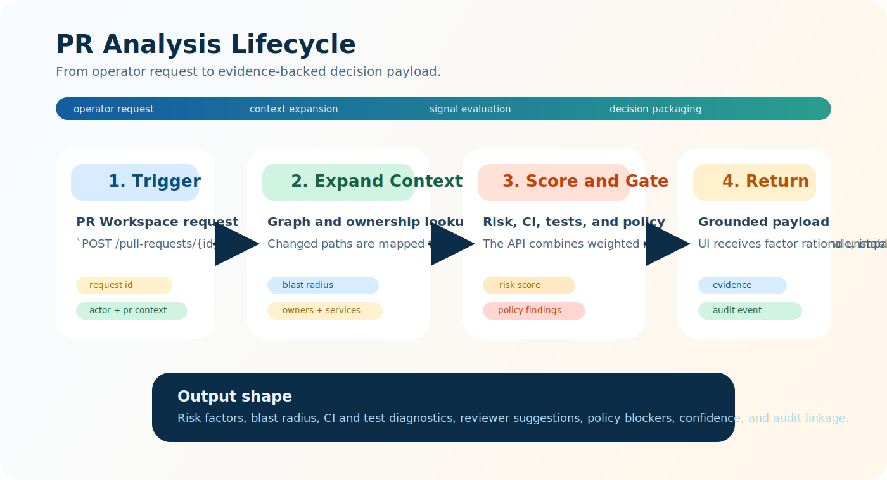
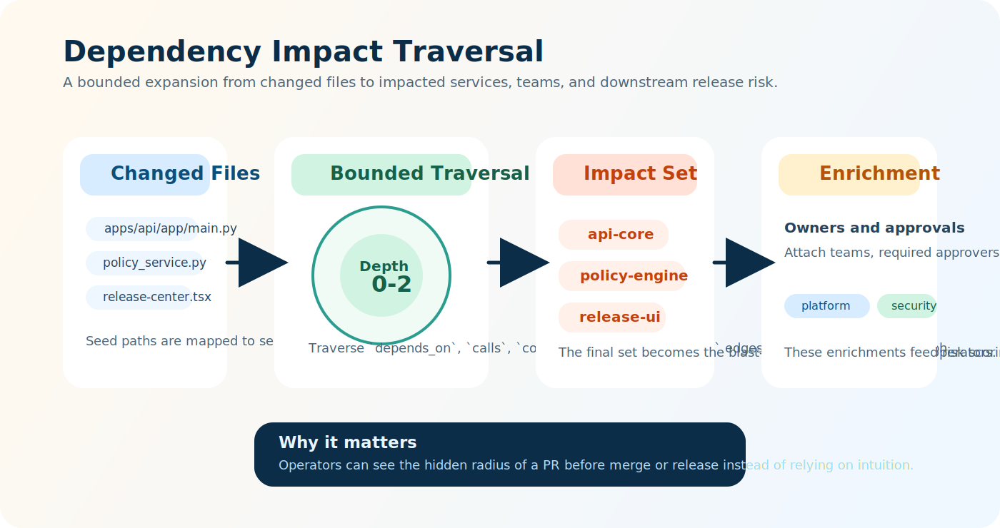
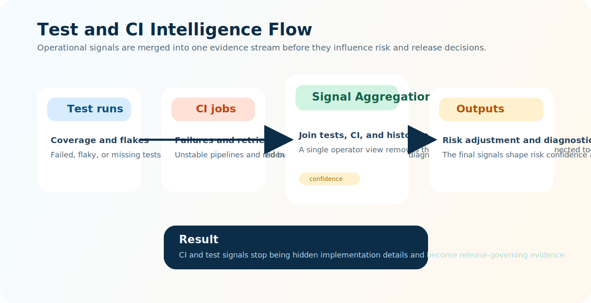
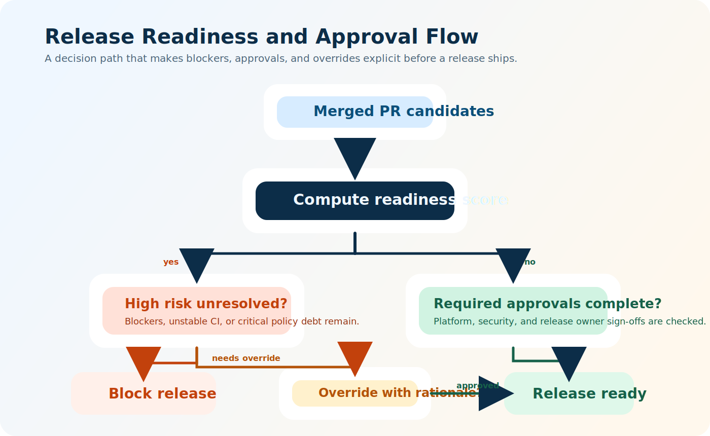
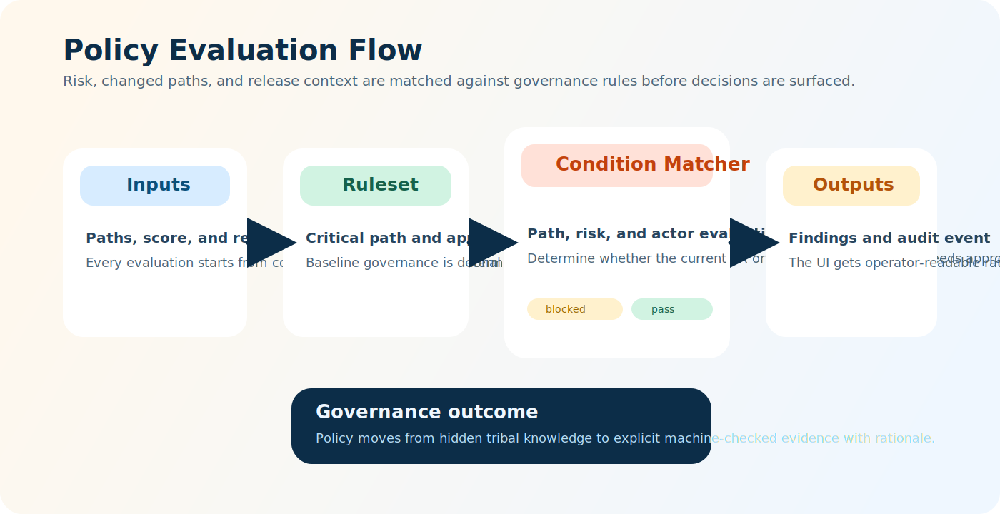
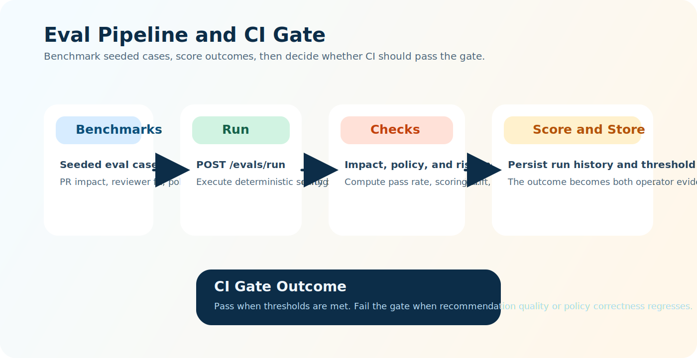

# VANGUARD System Overview

VANGUARD is a local-first engineering intelligence platform built to make pull request and release decisions inspectable. Instead of scattering evidence across CI logs, tribal knowledge, and dashboards, it brings the signals into one operator workflow.

## Architecture Snapshot

### Layer Breakdown

| Layer | Responsibility |
|---|---|
| Operator Surfaces | Dashboard, PR Workspace, Release Center, Policy and Audit views |
| API Orchestration | FastAPI routes for analysis, impact, policy, release, health, evals, and audit |
| Intelligence Engines | Risk scoring, policy evaluation, reviewer routing, graph traversal, CI and test aggregation |
| Data Fabric | Seeded datasets plus PostgreSQL, Redis, Neo4j, and OpenSearch |

## End-to-End Flows

### PR Analysis Lifecycle

This flow starts in the PR Workspace and ends with a grounded response payload. The API expands blast radius, scores weighted factors, evaluates policy, and writes an audit event before returning the result to the UI.

### Dependency Impact Traversal

Impact analysis is intentionally bounded. VANGUARD expands from changed paths into service relationships, enriches the affected set with ownership, and turns that graph evidence into an operator-readable blast radius.

### Test and CI Intelligence

Test and CI evidence is aggregated before it affects risk confidence or release status. This gives operators one coherent signal instead of requiring them to compare several tools manually.

### Release Readiness

Release readiness is a decision path, not a vague status badge. The platform checks unresolved risk, approval completeness, and justified override paths before a release can be considered ready.

### Policy Evaluation

Governance rules are matched against changed paths, risk state, and release context. The outcome is explicit: pass, block, or require approvals, all with rationale and auditability.

### Eval Pipeline

The eval harness turns benchmark quality into a hard gate. If policy correctness, risk quality, or recommendation relevance drifts below threshold, CI can fail before the regression lands.

## Design Intent

- Keep local development deterministic with seeded data and reproducible scenarios.
- Make every important decision explainable through factor-level evidence.
- Treat approvals and overrides as first-class audited events.
- Preserve room for future live providers without losing local-first behavior.
