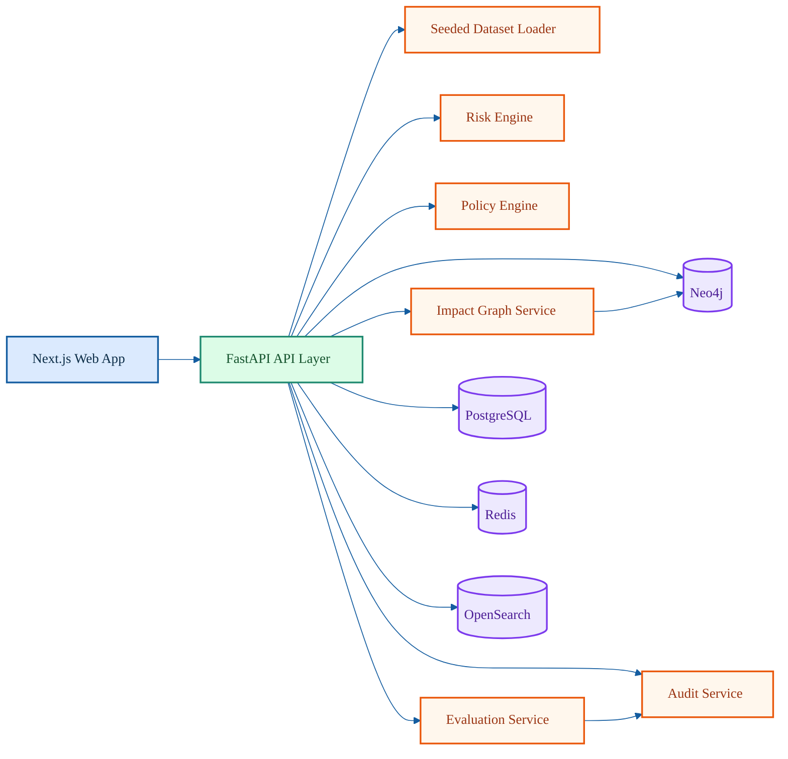

# VANGUARD System Overview

VANGUARD is a local-first engineering intelligence platform with:
- FastAPI backend for PR, release, policy, and risk APIs
- Next.js frontend for operator workflows
- PostgreSQL, Redis, Neo4j, OpenSearch for operational metadata and graph traversal
- Seeded datasets for deterministic local behavior
- Eval harness to validate recommendation and risk quality

